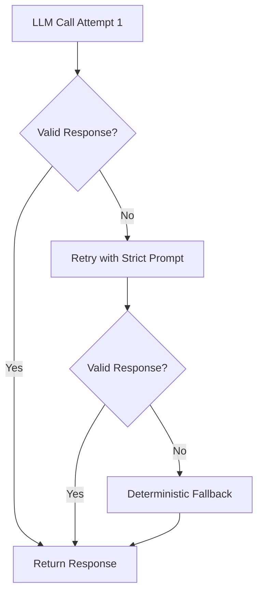

# Assist Mode - Phase 2 Ask Mode

## Overview

The Assist Mode provides AI-powered assistance for understanding and debugging n8n workflows. In Phase 2, we implement **Ask Mode**, which allows users to ask natural language questions about their workflows and receive intelligent, context-aware answers.

---

## Features

- **Fresh Workflow State**: Automatically syncs workflow to DB if changed (compares updatedAt with cache)
- **Workflow Context Analysis**: Automatically fetches and analyzes workflow structure, nodes, connections, and configuration
- **Improved Execution Error Parsing**: Multi-strategy parsing to find failed node even when execution data is complex
- **Latest Execution Error**: Fetches the most recent failed execution with raw error snippet for diagnostics
- **Anti-Hallucination Validation**: Strict validation ensures LLM only references actual nodes and real issues
- **Structured JSON Response**: Returns answer, topFixFirst, issues[], and citations[] in validated JSON format
- **Deterministic Fallback**: If LLM hallucinates, automatically falls back to deterministic response built from facts
- **Issue Detection**: Identifies missing credentials, disabled nodes, and actual execution errors
- **Safe Context Building**: Never includes secrets or sensitive data in LLM prompts
- **Token Budget Management**: Automatically limits context size for large workflows (max 300 nodes, max 100k tokens)
- **Detailed Debug Info**: Returns workflow sync status, execution error details, validation results

---

## API Endpoint

### POST `/api/v3/assist/ask`

Ask a question about a specific workflow.

**Request Body:**
```json
{
  "connectionId": "uuid",
  "workflowUuid": "uuid",
  "sessionId": "string",
  "message": "What does this workflow do?"
}
```

**Response (Success):**
```json
{
  "ok": true,
  "answer": "This workflow does X, Y, and Z...",
  "topFixFirst": "Fix the error in \"Node Name\": error message",
  "issues": [
    "Node \"X\" is missing credentials",
    "Node \"Y\" is disabled"
  ],
  "citations": ["Node Name", "Node X", "Node Y"],
  "debug": {
    "analyzed_n8n_workflow_id": "W9ieVFP07905WJzC",
    "analyzed_source": "prod",
    "workflow_updated_at_from_n8n": "2026-02-03T10:30:00.000Z",
    "cache_updated_at": "2026-02-03T10:30:00.000Z",
    "workflow_synced": false,
    "workflow_unchanged": true,
    "contextPackSummary": {
      "workflowName": "My Workflow",
      "nodeCount": 15,
      "uniqueTypes": 8,
      "missingCredentials": 1,
      "evaluationIssues": 2,
      "latestExecutionError": "YES"
    },
    "executionErrorDebug": {
      "executionId": "abc123",
      "status": "error",
      "failedNode": "Supabase Query",
      "rawErrorSnippet": {
        "source": "runData",
        "nodeName": "Supabase Query",
        "message": "relation 'users' does not exist"
      }
    },
    "validation": {
      "errors": [],
      "warnings": []
    },
    "llmAttempts": 1,
    "usedDeterministicFallback": false,
    "sessionId": "..."
  }
}
```

**Response (Error):**
```json
{
  "ok": false,
  "error": "Error message",
  "details": "Additional details..."
}
```

---

## Configuration

### Required Environment Variables

```bash
# Required for Ask mode to work
OPENAI_API_KEY=sk-...

# Optional - defaults
VN_ASK_MODEL=gpt-4o-mini      # or gpt-4o, gpt-4-turbo, etc.
VN_LLM_PROVIDER=openai        # only openai supported in Phase 2
```

### Optional Settings

| Variable | Default | Description |
|----------|---------|-------------|
| `VN_ASK_MODEL` | `gpt-4o-mini` | OpenAI model to use |
| `VN_LLM_PROVIDER` | `openai` | LLM provider (future: anthropic, etc.) |

---

## Safety Guardrails

The implementation includes several safety mechanisms:

### Privacy & Security
1. **No Secrets**: Credentials, API keys, and sensitive data are never included in LLM prompts
2. **Node Limits**: Workflows with >300 nodes are truncated to prevent token overflow
3. **Token Budget**: Total context limited to 100k tokens
4. **Schema Truncation**: Large node schemas are summarized, not sent in full
5. **Message Length**: User messages limited to 2000 characters
6. **Output Limits**: LLM responses capped at 2000 tokens

### Anti-Hallucination
7. **Response Validation**: Backend validates that LLM responses only reference actual nodes
8. **Credential Check**: Rejects responses claiming missing credentials when none exist
9. **Citation Enforcement**: Ensures citations[] is populated when issues exist
10. **Retry with Stricter Prompt**: On validation failure, retries once with stricter instructions
11. **Deterministic Fallback**: If LLM continues to hallucinate, uses fact-based response
12. **JSON Mode**: Forces LLM to return structured JSON (requires GPT-4o-mini or better)

---

## Example Usage

### Via curl

```bash
curl -X POST http://localhost:3000/api/v3/assist/ask \
  -H "Content-Type: application/json" \
  -d '{
    "connectionId": "197d5090-ca6b-49b5-b0b0-60893802eee0",
    "workflowUuid": "ac7e559a-b538-4399-9f49-23d279054c23",
    "sessionId": "user-001",
    "message": "What does this workflow do?"
  }'
```

### Via JavaScript/Fetch

```javascript
const response = await fetch('http://localhost:3000/api/v3/assist/ask', {
  method: 'POST',
  headers: { 'Content-Type': 'application/json' },
  body: JSON.stringify({
    connectionId: '197d5090-ca6b-49b5-b0b0-60893802eee0',
    workflowUuid: 'ac7e559a-b538-4399-9f49-23d279054c23',
    sessionId: 'user-001',
    message: 'Why is this workflow failing?',
  }),
});

const data = await response.json();
console.log(data.answer);
```

---

## Testing

### Doctor Script

The doctor script includes an automated test for the Assist Ask endpoint:

```bash
# Run with OpenAI API key
OPENAI_API_KEY=sk-... \
DOCTOR_WORKFLOW_UUID=ac7e559a-b538-4399-9f49-23d279054c23 \
DOCTOR_CONNECTION_ID=197d5090-ca6b-49b5-b0b0-60893802eee0 \
npm run doctor
```

**Expected Output:**
```
--- Assist Ask Mode ---
[INFO] Testing: POST http://127.0.0.1:3000/api/v3/assist/ask
[PASS] Assist Ask endpoint works
[INFO] Answer preview: This workflow appears to be a customer support chatbot that...
[INFO] Context: 15 nodes, 8 types
[INFO] Tokens: 1801 (1234 prompt + 567 completion)
```

### Manual Testing

```bash
# Test with a simple question
curl -X POST http://localhost:3000/api/v3/assist/ask \
  -H "Content-Type: application/json" \
  -d '{
    "connectionId": "YOUR_CONNECTION_ID",
    "workflowUuid": "YOUR_WORKFLOW_UUID",
    "sessionId": "test-001",
    "message": "Summarize this workflow in one sentence"
  }'
```

---

## Implementation Details

### Architecture

```
User Request
    ↓
POST /api/v3/assist/ask
    ↓
1. Resolve UUID → n8n Workflow ID
2. Fetch Workflow JSON from n8n
3. Check if Workflow Changed (compare updatedAt with cache)
    - If changed or cache missing: Sync nodes to DB
    - Calls same sync logic as /api/n8n/sync
    - Updates cache with fresh workflow state
4. Fetch Latest Execution Error (improved parsing)
    - Try resultData.error (top-level)
    - Try runData for failed node
    - If unknown, fetch full execution details
    - Include raw error snippet in debug
5. Build Context Pack
    - Workflow metadata
    - nodes[] array (explicit list)
    - missingCredentials[] array (explicit list)
    - evaluationIssues[] array (explicit list)
    - latestExecutionError (failed node + message)
6. Build LLM Prompt with strict instructions
    - List all valid node names
    - List all actual issues
    - Require JSON response format
7. Call LLM (OpenAI with JSON mode)
8. Parse & Validate Response
    - Check citations reference real nodes
    - Check no false credential claims
    - Check citations populated if issues exist
9. If Validation Fails:
    - Retry once with stricter prompt (lower temp)
    - If still fails, use deterministic fallback
10. Return Structured Response
    - answer, topFixFirst, issues[], citations[]
    - debug: workflow sync info, execution details
```

### Anti-Hallucination Flow



**Validation Checks:**
1. All cited nodes exist in nodes[] array
2. Quoted nodes in answer exist in workflow
3. No credential claims if missingCredentials.length === 0
4. citations[] not empty when issues[] is populated
5. topFixFirst references actual nodes

### Fresh Workflow State Guarantee

The endpoint ensures you're analyzing the **current** workflow state:

1. **Fetch from n8n**: Gets latest workflow JSON including `updatedAt` timestamp
2. **Compare with Cache**: Checks if workflow changed since last sync
3. **Auto-Sync if Changed**: If `updatedAt` differs or cache missing:
   - Syncs nodes to database
   - Updates node library coverage
   - Links workflow nodes to node definitions
   - Same logic as `POST /api/n8n/sync`
4. **Build Context**: Context pack uses freshly synced data

**Debug Fields:**
- `workflow_updated_at_from_n8n`: Timestamp from n8n
- `cache_updated_at`: Previously cached timestamp
- `workflow_synced`: `true` if sync was performed
- `workflow_unchanged`: `true` if no changes detected

### Improved Execution Error Parsing

Three-strategy approach to find the failed node:

**Strategy 1: Top-Level Error**
```javascript
if (execution.data?.resultData?.error) {
  // Extract message and stack trace
  errorMessage = error.message;
}
```

**Strategy 2: RunData Search**
```javascript
for (const [nodeName, nodeData] of runData) {
  if (lastRun.error) {
    failedNode = nodeName; // Found it!
  }
}
```

**Strategy 3: Full Execution Fetch**
```javascript
if (failedNode === 'Unknown') {
  // Fetch complete execution with GET /api/v1/executions/:id
  // Parse full runData for error status
}
```

**Debug Output:**
```json
"executionErrorDebug": {
  "executionId": "abc123",
  "failedNode": "Supabase Query",
  "rawErrorSnippet": {
    "source": "runData",
    "nodeName": "Supabase Query",
    "message": "relation 'users' does not exist"
  }
}
```


### Files

| File | Purpose |
|------|---------|
| `src/llm/router.ts` | LLM provider abstraction layer |
| `src/v3/assistContext.ts` | Context pack builder |
| `src/routes/v3.ts` | `/assist/ask` endpoint |
| `scripts/doctor.ts` | Automated testing |
| `docs/ASSIST.md` | This file |

---

## Error Handling

### Common Errors

| Error | Cause | Solution |
|-------|-------|----------|
| `OPENAI_API_KEY not configured` | Missing env var | Set `OPENAI_API_KEY` in `.env` |
| `Workflow too complex` | >100k tokens | Reduce workflow size or use shorter questions |
| `Failed to get AI response` | OpenAI API error | Check API key, rate limits, billing |
| `Failed to fetch workflow from n8n` | n8n connection issue | Verify connection credentials |

---

## Roadmap

### Phase 2 (Current)
- ✅ Ask mode endpoint
- ✅ OpenAI integration
- ✅ Context pack builder
- ✅ Safety guardrails
- ✅ Doctor test

### Phase 3 (Future)
- [ ] Citations (extract node names mentioned in answers)
- [ ] Conversation history / multi-turn
- [ ] Plan mode (generate step-by-step fixes)
- [ ] Agent mode (execute fixes automatically)
- [ ] Support for other LLM providers (Anthropic, local models)
- [ ] Enhanced schema resolution from node library

---

## Troubleshooting

### "OPENAI_API_KEY not configured"

```bash
# Add to .env
echo "OPENAI_API_KEY=sk-your-key-here" >> .env

# Restart backend
npm run dev
```

### "Workflow too complex for Ask mode"

The workflow has too many nodes (>300) or generates too much context (>100k tokens). Try:
1. Ask more specific questions (reduces response tokens)
2. Split workflow into smaller sub-workflows
3. Increase limits in code (not recommended)

### LLM returns generic answers

The context pack may be too minimal. Future improvements will:
- Include full node schemas from the node library
- Add connection analysis
- Include recent execution history

---

## Support

For questions or issues:
1. Check this documentation
2. Run `npm run doctor` to verify setup
3. Check backend logs for detailed error messages
4. Review OpenAI API dashboard for rate limits/billing issues
